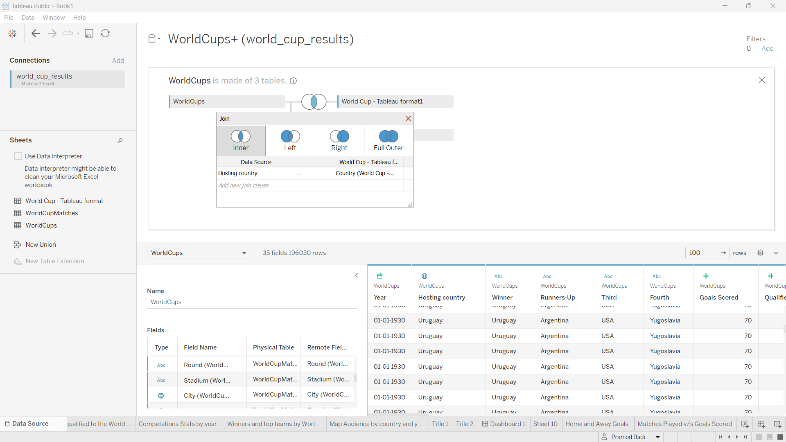

## 3. What are the different joins supported by tableau? (With the help of an example create one in tableau)

<b>The common types of joins in Tableau are:</b>

<b>1. Inner Join:</b> 
An inner join returns only the rows that have matching values in both tables being joined. It includes only the data that appears in both tables.

<b>2. Left Join:</b> 
A left join returns all the rows from the left table and the matching rows from the right table. If there are no matches in the right table, it includes null values for the columns of the right table.

<b>3. Right Join:</b> 
A right join returns all the rows from the right table and the matching rows from the left table. If there are no matches in the left table, it includes null values for the columns of the left table.

<b>4. Full Outer Join:</b> 
A full outer join returns all the rows from both tables. It includes all the data from the left table and the right table, and if there are no matches, it includes null values for the non-matching columns.

