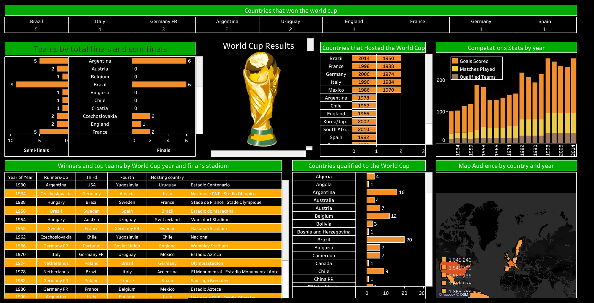

## 5. Explain the steps to create dashboard in tableau with example (With the help of an example create one in tableau).

Dataset Used: [World Cup](Datasets/world_cup_results.xlsx)

To create a dashboard in Tableau, follow these steps:

Step 1: Connect to Data
- Launch Tableau and connect to the desired data source (e.g., Excel, CSV, database).
- Select the tables or data sources you want to use in your dashboard.

Step 2: Build Worksheets
- Create individual worksheets by dragging and dropping fields from the data pane onto the canvas.
- Apply appropriate visualizations (e.g., bar chart, line chart, map) to represent the data in each worksheet.
- Customize the formatting, labels, colors, and other visual properties as needed.

Step 3: Arrange Worksheets on the Dashboard
- Go to the Dashboard tab by clicking on the "New Dashboard" button.
- Drag and drop the worksheets you created onto the dashboard canvas.
- Resize and rearrange the worksheets to achieve the desired layout.
- Use containers, horizontal/vertical layouts, and text boxes to organize and annotate the content.

Step 4: Add Interactivity and Filters
- Enhance the user experience by adding interactive elements such as filters, parameters, and actions.
- Use filters to allow users to dynamically explore and analyze the data.
- Configure actions to enable users to navigate between different worksheets or dashboards based on selections.

Step 5: Format and Customize the Dashboard
- Apply formatting options to the dashboard to make it visually appealing and intuitive.
- Adjust the size, alignment, and spacing of the components.
- Add titles, captions, and legends to provide context and explanations.
- Choose appropriate fonts, colors, and backgrounds to match your design preferences.

Step 6: Test and Publish
- Preview the dashboard to ensure all elements are displaying correctly and functioning as intended.
- Test the interactivity and filters to verify the expected behavior.
- Save the dashboard and publish it to Tableau Server, Tableau Public, or other platforms for sharing with others.

Example:
Let's say you want to create a dashboard that analyzes world cup data.

1. Connect to your world cup data source

2. Drag the necessary fields to create the worksheets. Choose a suitable visualization, such as a bar chart, to represent the data.

3. Switch to the Dashboard tab and drag created worksheets. Resize and arrange them to fit your desired layout, such as side by side or in separate sections.

4. Add interactivity by placing a filter for the "Region" field on the dashboard. Users can select a specific region to see the corresponding data.

5. Format the dashboard by adjusting the sizes, fonts, colors, and other visual properties. Add a title and captions to provide context and explanation for the data.

6. Test the dashboard to ensure that the filters and interactivity work as expected. Save the dashboard and publish it to share with others or embed it on a website.

By following these steps, you can create an informative and visually appealing dashboard in Tableau.

